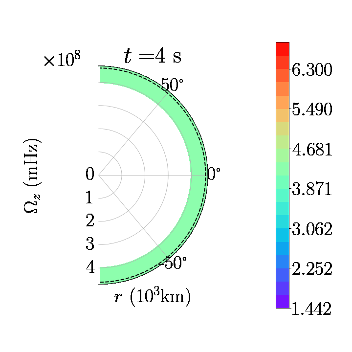
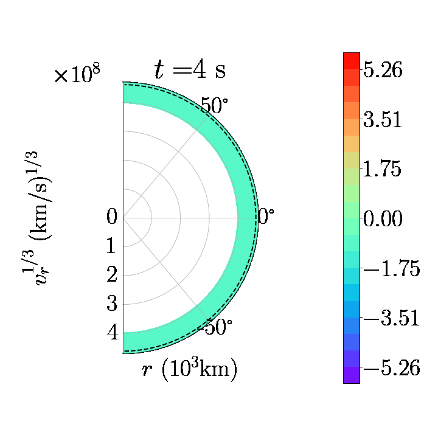
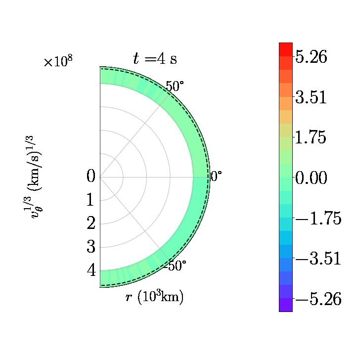
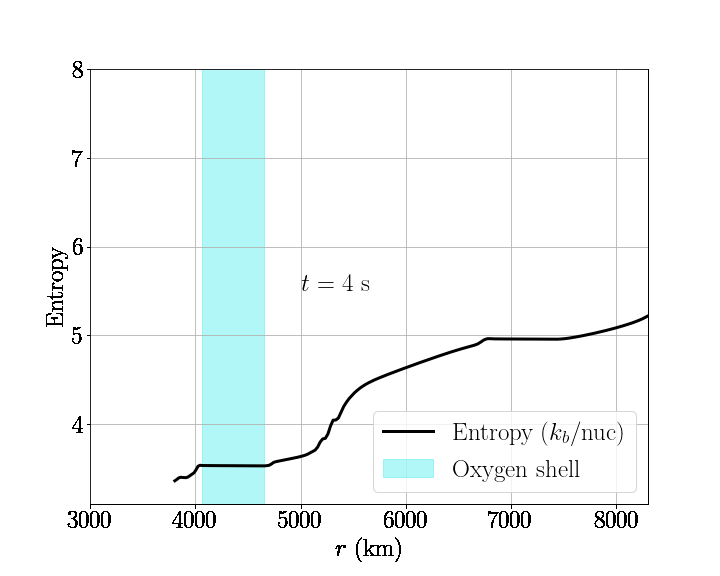
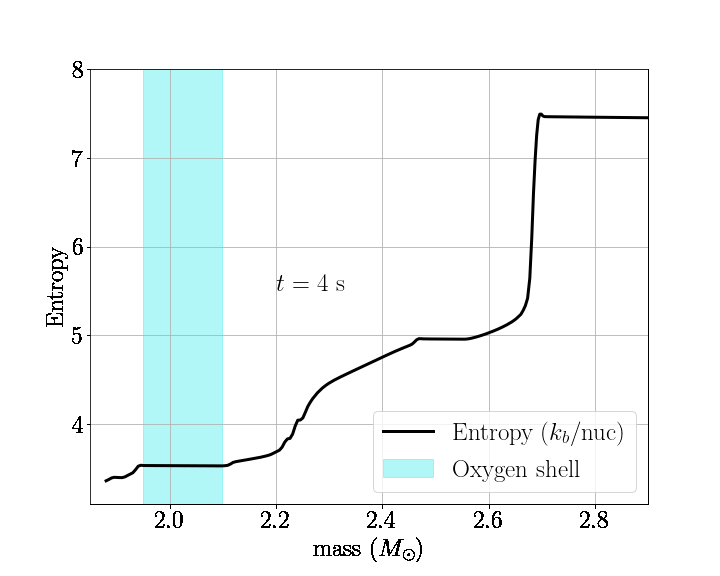

# Movies for rapidly rotating he16 model

Here we show .gifs of 2D slices (i.e. azimuthally averaged) of quantities related to differential rotation, in the inner most convective oxygen burning region.

## Angular velocity

(rotation rate)

## Radial velocity

(convective updrafts and downdrafts)

## Latitudinal velocity

(meridional circulation)

Next we show .gifs of the (spherically averaged) radial entropy profiles (black) over the course of the simulation, along with the corresponding oxygen shell definition (cyan) at that time.

## Entropy vs radius

## Entropy vs mass

