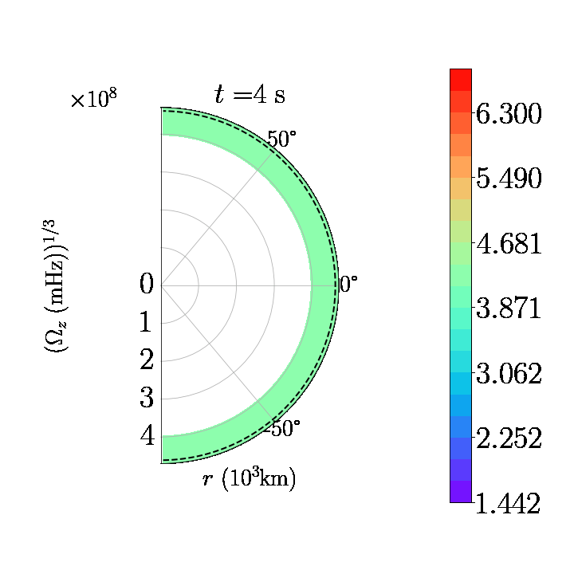

# Movies for rapidly rotating he16 model

Here we show .gifs of 2D slices (i.e. azimuthally averaged) of quantities related to differential rotation, in the inner most convective oxygen burning region.

## Angular velocity

(rotation rate)

## Radial velocity

(convective updrafts and downdrafts)

## Latitudinal velocity

(meridional circulation)

